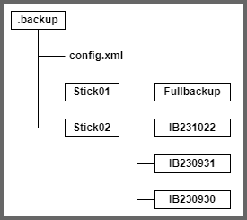

### Step1: Backup aktivieren

|                  |                                                                              |
| ---------------- | ---------------------------------------------------------------------------- |
| Kurzbeschreibung | Einen neuen Stick wird eine UUID zugeordnet. Ein Ordner wird auf U:\ erzeugt |
| Aktöre           | Benutzer (Lehrer)                                                            |
| Auslöser         | Benutzer wählt Menüpunkt "Sicherung einrichten" aus                          |
| Ergebnis         | Der Stick hat eine UUID und ein Ordner mit gleicher UUID wurde erstellt      |
| Eingehende Daten | -                                                                            |
| Vorbedingungen   | Der Datenträger ist verschlüsselt und lesbar                                 |
| Nachbedingungen  | Erstes Vollbackup soll starten                                               |
| Schritte         | - Datenträger wird eingesteckt                                               |
|                  | - Programmpunkt "Sicherung einrichten" klicken                               |
|                  | - Kennungsdatei wird auf Stick abgelegt                                      |
|                  | - UUID wird generiert                                                        |
|                  | - Verzeichnisse auf U:\ werden angelegt                                      |
|                  | - Vollbackup wird gestartet                                                  |
| Sonstiges        | Benutzer soll bei jedem Schritt ein visuelles Feedback bekommen              |
| Offene Fragen    | Dateiformat, Pfadbenennung, Conig Daten                                      |

---

Das System soll ein Backup machen, wenn die ID des Sticks mit dem im Ordner auf U:\ übereinstimmt.  
Zuerst muss das Backup manuell aktiviert werden. Das wird erst möglich wenn ein verschlüsselter Sick im Laufwerk ist.  
Um das herauszufinden scannt das Programm alle 10 Sekunden die Laufwerke.

In der Taskleiste soll ein kleines Icon zu sehen sein (System-Tray-Icons).  
Wenn der User das Icon anklickt erscheint ein minimalistisches Menü.  
Eines der Menüpunkte ist "Sicherung einrichten", dass nur aktiv ist, wenn ein gültiger Stick im Laufwerk liegt.  
Befindet sich noch keine UUID auf dem Stick, kann sie mit einem Klick des Menüpunktes eingerichtet werden.

Dazu wird erst eine Kennungsdatei mithilfe von Java erstellt, fals noch nicht vorhanden.  
Java kann Klassen in JSON Dateien serialisieren. Es gibt bereits sehr hilfreiche Funktionen dafür.  
In dieser Datei steht drin wann das letzte Backup stattgefunden hat und ob es komplett durchgeführt wurde.

```typescript
{
    uuid: string,
    ordner: string,
    datum: Date,
    isReady: boolean,
},
```

---

#### Ordnerstruktur



---

#### Vollbackup Prozess

- rekursiv = sich selbst aufrufend
- iterativ = Schritt für Schritt wiederholen

Die Pfade vom Zielordner und Quellordner müssen bekannt sein (In der Annahme das das Zielverzeichnis existiert)  
Dann werden alle Dateien Kopiert, entweder rekusiv oder iterativ. Fehlerhafte Dateien sollten nicht zu Programmabstürzen führen.

```java
import java.io.File;
import java.io.FileInputStream;
import java.io.FileOutputStream;
import java.io.IOException;
import java.nio.channels.FileChannel;

public class FileCopyExample {
    public static void main(String[] args) {
        File sourceFile = new File("path/to/source/file");
        File destFile = new File("path/to/destination/file");

        try (FileChannel sourceChannel = new FileInputStream(sourceFile).getChannel();
             FileChannel destChannel = new FileOutputStream(destFile).getChannel()) {
            destChannel.transferFrom(sourceChannel, 0, sourceChannel.size());
        } catch (IOException e) {
            e.printStackTrace();
        }
    }
}

```
