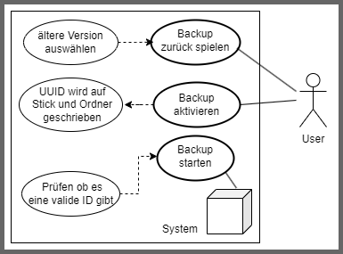

### Usecase

#### Notizen

- Beim ersten einstecken kann das Backup aktiviert werden und ein Kennwort vergeben werden
- Beim erneuten einstecken des Sticks wird das Kennwort erfragt
- Es gibt beim einstecken in "neue" Pcs eine Frage ob eine Sicherung eingerichtet werden soll
- Programm befindet sich im persönlichen Autostart
- Mit Skripten kann die Einrichtung automatisiert werden
- Backup aktivieren und Backup zurück spielen sind Menüpunkte

---

#### Step1: Backup aktivieren
